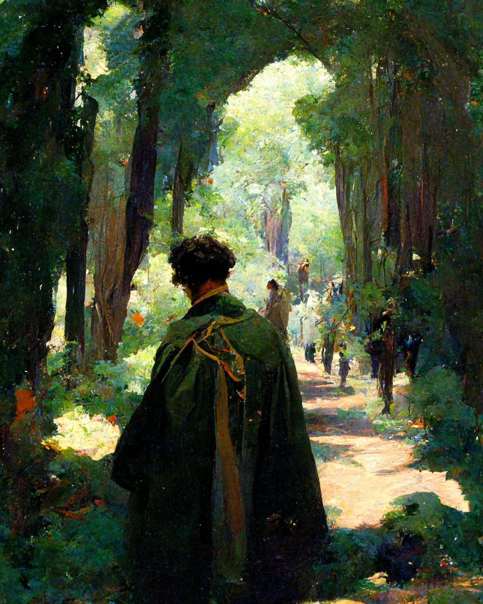

# Brigand
A seasoned bandit living in the mountains and forest. A killer swiftly taking
what he can from weary travelers and merchants

**Starting Equipment:** Hooded Cloak, Leather Armor, Longbow, Arrows, Longsword

**Starting Skill:** Traps, Stealth, Intimidation

**Bonus:** You deal +[Brigand Template] damage on surprise rounds

**Disadvantage:** there is a 1/3 chance you are known and wanted in each
settlement you enter

### A: Brigand Camps
You aren’t welcomed in many places and so you've found others like you spread
out. In any location there is a 2/3 chance you can find a brigand camp nearby.
They’ll welcome you, but keep an eye on your coin purse.

### A: Overdraw
You may attempt a strength check to overdraw your bow. Roll strength, if you
are successful your next attack this turn deals double it’s normal damage die.
If you fail you may make a normal attack at disadvantage.You may always
overdraw for a surprise attack.

### B: Close and Personal
You aren’t afraid to get close and personal, in fact there’s something about
taking a life by hand that you might find interesting. Your attacks with swords
and knives deal +2 damage.

### B: Road Traps
You know how and where to setup traps, traps for… larger animals. You can build
deadly and effective traps in under 10 min and for half the price.

### C: Opportunist
You are quick to act on small opening in melee combat. You may make a free
attack on an enemy if you succeed a defense role within 3 of your Defense.

### C: Fleet
Brigands are quick on their feet. After everyone has finished their turn in a
combat you may make an additional move.

### D: Infamous
You are an infamous brigand, merchants and citizens are weary of your name.
Your aren’t welcomed in towns or cities, but your are revered by other outlaws
and criminals.
